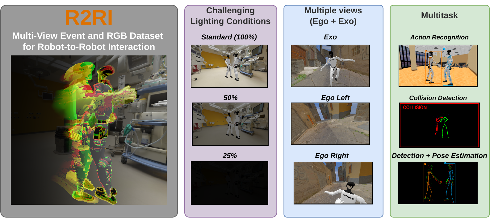
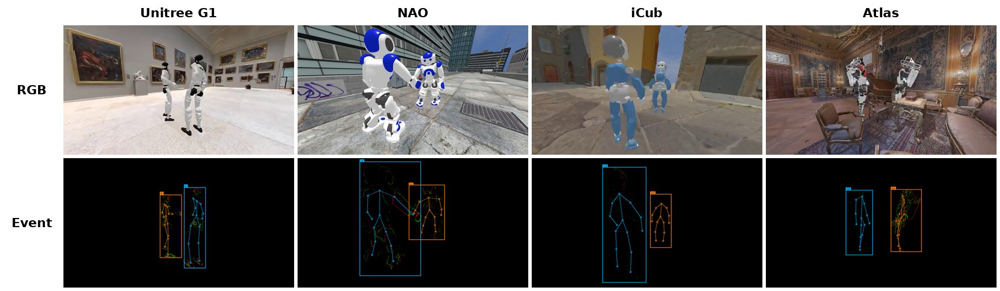
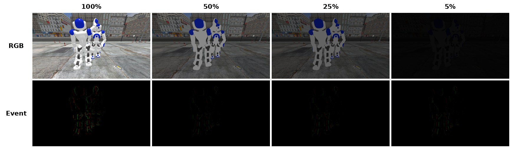
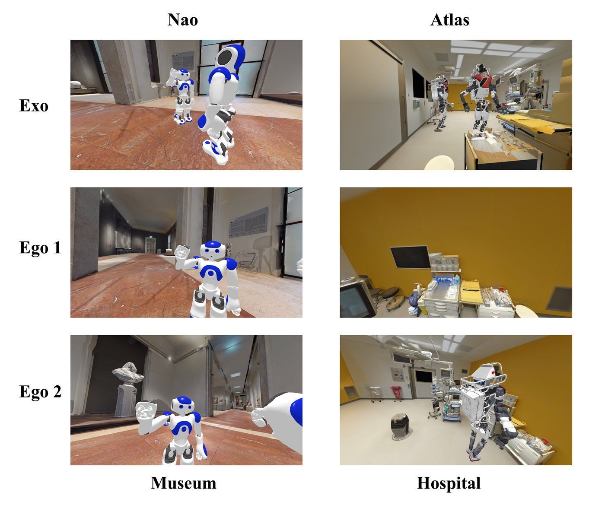
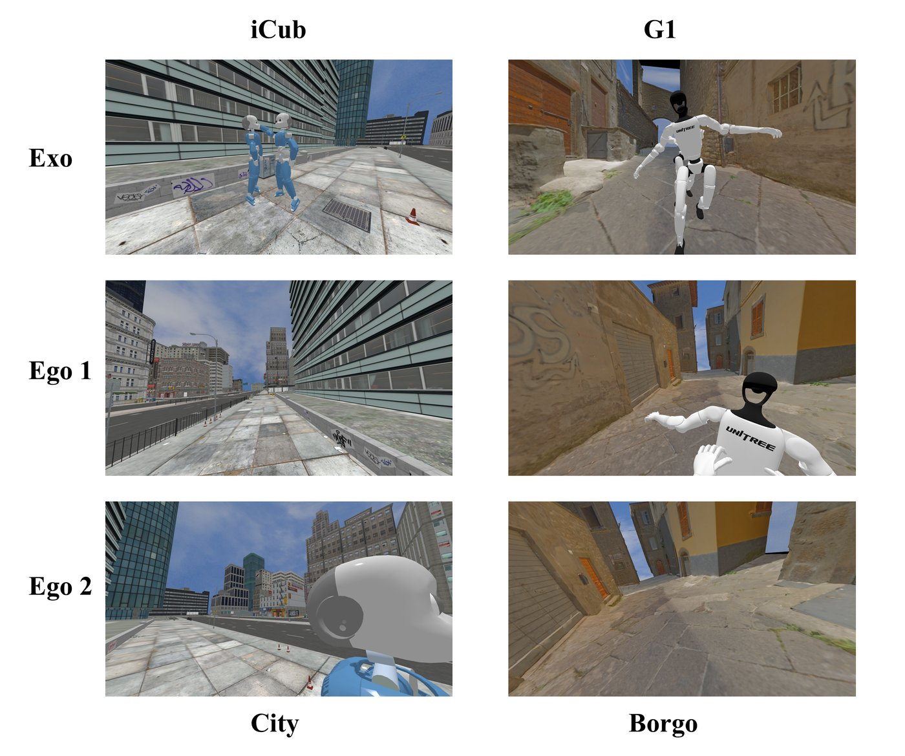
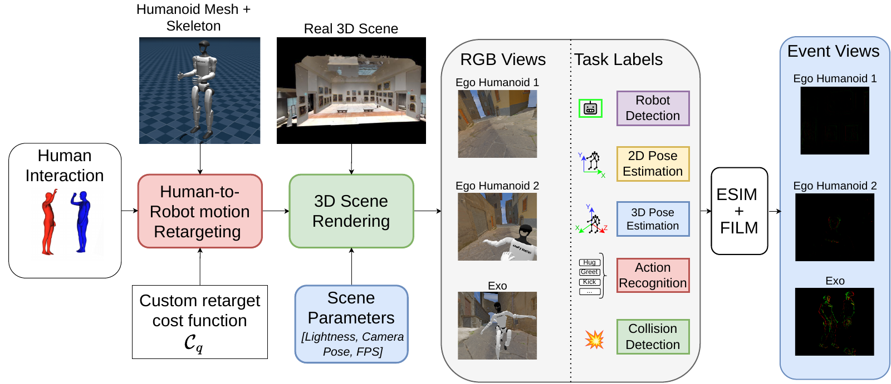

# R2RI: A Multi-View Event and RGB Dataset for Robot-to-Robot Interaction

**Gabriele Magrini**1,\*, **Riccardo Catalini**2,\*, Federico Becattini3, Guido Borghi2, Pietro Pala1, Roberto Vezzani2, Lorenzo Seidenari1

1 University of Florence &nbsp;·&nbsp; 2 University of Modena and Reggio Emilia &nbsp;·&nbsp; 3 University of Siena
 \* Equal contribution

  

R2RI is the first large-scale dataset designed for **Robot-to-Robot Interaction (RRI)**. Pairs of humanoid robots perform interactions modeled on real human social behaviors, captured from an **exocentric** fixed camera and from the **egocentric** cameras of each robot, in both **RGB** and **event** domains.

## Download

The dataset and its annotations are hosted on Hugging Face:

**➡️ [huggingface.co/datasets/r2ri/R2RI](https://huggingface.co/datasets/r2ri/R2RI)**

## At a glance

| | |
|---|---|
| Sequences | ≈ 5000 |
| Frames | 6.5 million |
| Frame rate | 120 fps |
| Clip duration | 1.8–23.5 s (mean 5.8 s) |
| Interaction classes | 20 |
| Robots | Unitree G1, NAO, iCub, Atlas |
| Viewpoints | Exocentric + 2 egocentric (one per robot) |
| Modalities | RGB, Depth, Event |
| Lighting | Standard (100%) and reduced-illumination conditions |

## Samples

**Four humanoid robots, RGB and event streams** (exocentric view, with 2D pose and bounding-box annotations overlaid on the event frames):

**Challenging lighting conditions.** RGB degrades as illumination drops, while the event stream keeps the robot silhouettes visible:

**Exocentric and egocentric views** of the same scene, indoor and outdoor:

  
  

## How it is built

Human interactions from [INTER-X](https://github.com/liangxuy/Inter-X) are retargeted to each robot's URDF model, placed in realistic 3D scenes and rendered as RGB from multiple cameras; event streams are then simulated from the high-frame-rate RGB.

## Tasks and benchmarks

R2RI comes with annotations and baselines for:

- Robot detection (2D bounding boxes)
- 2D robot pose estimation
- 3D robot pose estimation
- 2D and 3D pose forecasting
- Robot collision detection
- Robot-to-robot action recognition (20 classes)
- Sim-to-real transfer (zero-shot, on real robot videos)

<b>The 20 interaction classes</b>

Hug, Wave, Hit, Kick, Push, Pull, Slap, Pat on back, Point finger at, Step on foot, Chase, Rock-paper-scissors, Link arms, Bend, Chat, Pat on cheek, Thumb up, Touch head, Imitate, Look back.

## Citation

The paper is currently under review. Citation information will be added here.

## Contact

Gabriele Magrini — gabriele.magrini@unifi.it
